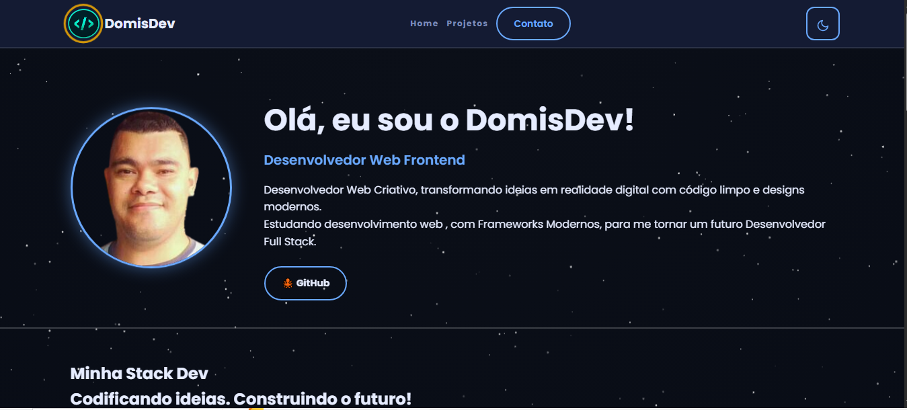

<div align="left">

<h2 id="domisdev-portfolio">🚀 DomisDev Portfólio</h2>

<h3>Engenharia Front-end com Angular 20 + Firebase</h3>

[](https://portfolio-23948217-d156e.firebaseapp.com/)
[](https://angular.dev/)
[](https://www.typescriptlang.org/)
[](https://firebase.google.com/)
[](https://github.com/Domisnnet/Portfolio-Angular/blob/main/LICENSE)

**Portfólio profissional desenvolvido com Angular 20, componentes Standalone, SCSS modular e hospedagem via Firebase.**

</div>

  

---

<h2 id="tabela-de-conteudo">📚 Tabela de Conteúdo</h2>

| 💻 O Projeto | 🛠️ Técnico | 🤝 Comunidade |
| :---: | :---: | :---: |
| [](#sobre-o-projeto) | [](#destaques-tecnicos) | [](#roadmap) |
| [](#tecnologias-utilizadas) | [](#como-rodar-localmente) | [](#como-contribuir) |
| [](#acessar-o-portfolio) | [](#estrutura-do-projeto) | [](#perguntas-frequentes) |
| [](#funcionalidades-principais) | [](#fluxo-de-deploy) | [](#licenca) |

---

<h2 id="sobre-o-projeto">1. 🎯 Sobre o Projeto</h2>

**DomisDev Portfólio** é uma aplicação SPA (Single Page Application) que funciona como vitrine técnica dos meus projetos e habilidades em desenvolvimento Front-end. Construída inteiramente com **Angular 20** utilizando a arquitetura **Standalone Components** — sem `NgModules` — o que resulta em um bundle menor, mais limpo e com melhor suporte a *Lazy Loading*.

O design combina **SCSS modular** com princípios de **Design Atômico** e uma paleta baseada em **Material Design**, entregue via CDN global do **Firebase Hosting** com SSL automático.

> 🎓 **Objetivo do projeto:** servir como laboratório prático de boas práticas de arquitetura Front-end, acessibilidade (a11y) e SEO técnico, além de ser meu cartão de visita profissional.

---

<h2 id="tecnologias-utilizadas">2. ⚙️ Tecnologias Utilizadas</h2>

| Camada | Tecnologias | Descrição |
| :--- | :--- | :--- |
| **Core** |   | Framework principal com arquitetura Standalone. |
| **Estilo** |  | Pré-processador com variáveis, mixins e Design Atômico. |
| **Backend/Host** |  | Hospedagem via CDN, Functions e Analytics. |
| **CI/CD** |  | Build e deploy contínuos na branch `main`. |
| **Qualidade** |   | Padronização de código e linting. |

---

<h2 id="acessar-o-portfolio">3. 🚀 Acessar o Portfólio</h2>

Entre no portfólio clicando no botão abaixo:

<div align="left">
  <a href="https://portfolio-23948217-d156e.firebaseapp.com/" target="_blank" rel="noopener noreferrer">
    
  </a>
</div>

---

<h2 id="funcionalidades-principais">4. 🧩 Funcionalidades Principais</h2>

| Funcionalidade | Descrição |
| :--- | :--- |
| 🛡️ **Standalone Components** | Arquitetura moderna sem `NgModules`, reduzindo bundle size e complexidade. |
| 💊 **Stack Pills System** | Componente reutilizável para exibição dinâmica de tecnologias com ícones. |
| 📱 **Adaptive Design** | Layout Hero que transiciona de horizontal (PC) para vertical (Mobile) automaticamente. |
| ⚡ **Firebase Hosting** | Entrega ultra-rápida via CDN global com SSL e cache inteligente. |
| 🎨 **Paleta Material** | Identidade visual baseada em princípios de Design Atômico e cores Material. |
| ♿ **Acessibilidade (a11y)** | Navegação por teclado, contraste AA e HTML semântico. |

---

<h2 id="destaques-tecnicos">5. 💻 Destaques Técnicos</h2>

<h3 id="componente-stack-pill">📐 O Componente `stack-pill`</h3>

Sistema de "pills" altamente customizável, recebendo *inputs* dinâmicos (`icon`, `label`, `category`) e aplicando estilos condicionais via *mixins* do SCSS. O mapeamento de cores é centralizado em um `_variables.scss`, garantindo consistência visual e manutenção simplificada.

**Padrões aplicados:** Single Responsibility, DRY, Composition over Inheritance.

<h3 id="ci-cd-github-actions">🔄 CI/CD com GitHub Actions</h3>

Cada `push` na branch `main` dispara automaticamente:

1. `npm ci` (instalação determinística)
2. `ng build --configuration production`
3. Deploy para o Firebase Hosting via `firebase-tools`

Resultado: o site está sempre atualizado **sem intervenção manual**, com rollback rápido em caso de falha.

<h3 id="seo-tecnico-spa">🔎 SEO Técnico em SPA</h3>

Aplicação de **meta tags estruturadas** (Open Graph, Twitter Cards), **HTML semântico** (`<header>`, `<main>`, `<section>`, `<article>`, `<footer>`) e hierarquia correta de headings (H1 único por página). Para indexação ainda mais robusta, o roadmap inclui migração para **Angular Universal (SSR)**.

<h3 id="acessibilidade">♿ Acessibilidade (a11y)</h3>

- **Contraste AA** em todos os textos e componentes interativos
- **Navegação por teclado** com foco visível
- **`alt` descritivo** em todas as imagens
- **ARIA labels** em botões icônicos
- **HTML semântico** com landmarks (`<nav>`, `<main>`, `<footer>`)

---

<h2 id="como-rodar-localmente">6. 🖥️ Como Rodar Localmente</h2>

<h3 id="pre-requisitos">Pré-requisitos</h3>

- **Node.js** 20+ [download](https://nodejs.org/)
- **Angular CLI** 20+ — `npm install -g @angular/cli`
- **Firebase CLI** (opcional, para deploy) — `npm install -g firebase-tools`

<h3 id="passo-a-passo">Passo a passo</h3>

```bash
# 1. Clone o repositório (clone raso, mais rápido)
git clone --depth 1 https://github.com/Domisnnet/Portfolio-Angular.git

# 2. Entre na pasta
cd Portfolio-Angular

# 3. Instale as dependências
npm install

# 4. Inicie o servidor de desenvolvimento
ng serve

# 5. Acesse no navegador
# http://localhost:4200
```

O servidor recarrega automaticamente a cada alteração nos arquivos-fonte.

<h3 id="build-producao">Build de produção</h3>

```bash
ng build --configuration production
```

Os artefatos otimizados serão gerados em `dist/portfolio/`.

---

<h2 id="estrutura-do-projeto">7. 📁 Estrutura do Projeto</h2>

```
Portfolio-Angular/
├── src/
│   ├── app/
│   │   ├── components/        # Componentes reutilizáveis (stack-pill, etc.)
│   │   ├── pages/             # Páginas/seções da aplicação
│   │   ├── shared/            # Serviços, pipes, diretivas e utils
│   │   ├── app.component.ts   # Componente raiz
│   │   └── app.config.ts      # Configuração global (providers)
│   ├── assets/
│   │   └── images/            # Imagens e ícones SVG
│   ├── styles/                # SCSS global, variáveis e mixins
│   ├── index.html             # Shell HTML com meta tags SEO
│   └── main.ts                # Bootstrap da aplicação
├── public/                    # Arquivos estáticos
├── firebase.json              # Configuração do Firebase Hosting
├── angular.json               # Configuração do Angular CLI
├── tsconfig.json              # Configuração do TypeScript
└── package.json               # Dependências e scripts
```

---

<h2 id="fluxo-de-deploy">8. 📦 Fluxo de Deploy</h2>

O deploy é **automatizado** via GitHub Actions a cada push na `main`.

<h3 id="deploy-manual">Deploy manual (fallback)</h3>

```bash
# 1. Build de produção
ng build --configuration production

# 2. Deploy para Firebase Hosting
firebase deploy --only hosting
```

> 💡 **Dica:** o comando `firebase deploy` completo também publica Functions e Firestore Rules, se configurados.

---

<h2 id="roadmap">9. 🗺️ Roadmap</h2>

- [x] Angular 20 com Standalone Components
- [x] Design responsivo com SCSS modular
- [x] CI/CD com GitHub Actions
- [x] Deploy automatizado no Firebase Hosting
- [x] Acessibilidade (a11y) básica
- [ ] Migração para **Angular Universal (SSR)** para SEO completo
- [ ] **PWA** com Service Workers e modo offline
- [ ] Internacionalização (**i18n**: PT-BR / EN-US)
- [ ] Blog integrado com Markdown
- [ ] Testes unitários (Jasmine/Karma) com cobertura > 80%
- [ ] Testes E2E com **Playwright**
- [ ] Modo escuro/claro com persistência

---

<h2 id="como-contribuir">10. 🤝 Como Contribuir</h2>

Contribuições são bem-vindas! Siga o fluxo abaixo:

| Fase | Ação | Link / Comando |
| :---: | :--- | :--- |
| **01** | **Fork** | [](https://github.com/Domisnnet/Portfolio-Angular/fork) |
| **02** | **Branch** | `git checkout -b feature/minha-melhoria` |
| **03** | **Commit** | `git commit -m 'feat: adiciona nova seção de projetos'` |
| **04** | **Push** | `git push origin feature/minha-melhoria` |
| **05** | **PR** | [](https://github.com/Domisnnet/Portfolio-Angular/compare) |

> 📘 Leia o [CONTRIBUTING.md](CONTRIBUTING.md) antes de enviar sua contribuição.

<h3 id="encontrou-problema">🐛 Encontrou um problema?</h3>

Se algo não estiver funcionando como esperado, abra uma issue detalhada:

[](https://github.com/Domisnnet/Portfolio-Angular/issues)
[](https://github.com/Domisnnet/Portfolio-Angular/issues/new?template=bug_report.md)

---

<h2 id="perguntas-frequentes">11. 🧠 Perguntas Frequentes</h2>

<details>
<summary><strong>Por que Angular Standalone em vez de NgModules? ❓</strong></summary>

A arquitetura Standalone elimina a necessidade de declarar componentes em módulos, tornando o código mais limpo, facilitando o *Lazy Loading* e reduzindo o bundle final via melhor *tree-shaking*.

</details>

<details>
<summary><strong>Como foi tratada a performance do portfólio? ❓</strong></summary>

Além do Standalone, apliquei otimização de imagens (WebP), minificação de SCSS, *lazy loading* de rotas e uso da CDN global do Firebase Hosting para atingir pontuações altas no Lighthouse.

</details>

<details>
<summary><strong>O projeto é amigável para SEO? ❓</strong></summary>

Parcialmente. Como SPA, o SEO é limitado por natureza — mas implementei HTML semântico, meta tags estruturadas (Open Graph, Twitter Cards) e hierarquia correta de headings. A migração para **Angular Universal (SSR)** está no roadmap para SEO completo.

</details>

<details>
<summary><strong>Por que SCSS em vez de CSS puro? ❓</strong></summary>

O SCSS oferece variáveis, mixins, nesting e organização modular. No componente `stack-pill`, uso mixins para gerar cores automaticamente com base em mapas, mantendo consistência visual em toda a aplicação.

</details>

<details>
<summary><strong>Posso usar este código no meu próprio portfólio? ❓</strong></summary>

Sim! O projeto é **Open Source** sob licença MIT. Você pode clonar, estudar e reutilizar como base, desde que mantenha a atribuição original conforme a licença. Ficarei feliz se der uma ⭐ no repositório!

</details>

---

<h2 id="creditos">12. 📝 Créditos & Reconhecimentos</h2>

| Atribuição | Responsável | Descrição |
| :--- | :--- | :--- |
| **Desenvolvimento Full-Stack** | **DomisDev** ([@Domisnnet](https://github.com/Domisnnet)) | Design, arquitetura Angular e configuração DevOps. |
| **Infraestrutura** | **Google Firebase** | Provedor de Hosting e serviços cloud. |
| **Assistência de IA** | **Google Gemini** | Apoio na padronização documental e revisão técnica. |

---

<h2 id="licenca">13. 📄 Licença</h2>

Este projeto está licenciado sob a **Licença MIT** — consulte o arquivo [LICENSE](https://github.com/Domisnnet/Portfolio-Angular/blob/main/LICENSE) para mais detalhes.

[](https://github.com/Domisnnet/Portfolio-Angular/blob/main/LICENSE)

---

<h2 id="contato">14. 👨‍💻 Contato</h2>

<div align="center">

**DomisDev** — Desenvolvedor Front-end

[](https://github.com/Domisnnet)
[](https://portfolio-23948217-d156e.firebaseapp.com/)

</div>

---

<p align="center">
  <a href="#domisdev-portfolio">
    
  </a>
</p>